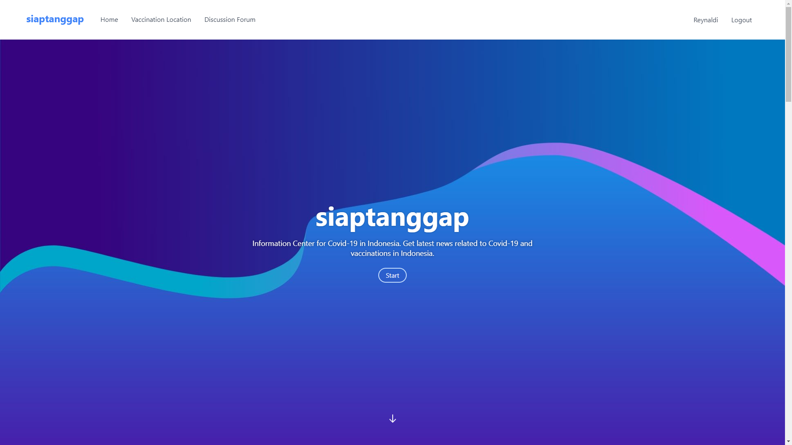
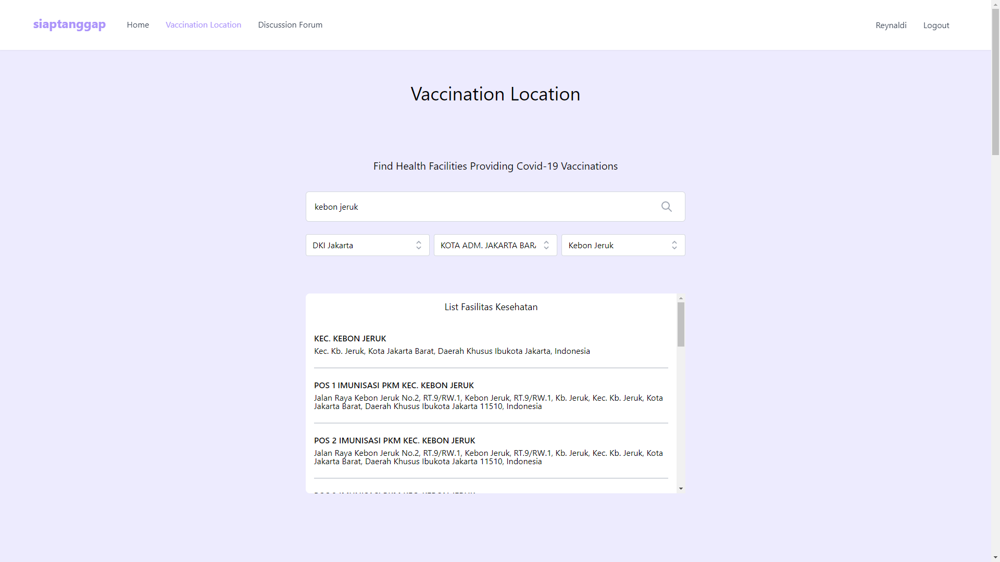

# siaptanggap

Pusat informasi Covid-19 di Indonesia. Dapatkan informasi terbaru terkait Covid-19 serta pelaksanaan vaksinasi di Indonesia.

## Teknologi
- Laravel 8
- TailwindCSS
- MySQL
- PHP

## Penggunaan
Instalasi
1. Unzip folder projek dan jalankan program XAMPP
2. Buat database di phpmyadmin dengan nama database "siap-tanggap" (tanpa kutip)
3. Import database dari file siap-tanggap.sql
4. Masukkan folder siap-tanggap ke directory htdocs XAMPP seperti pada gambar

5. Buka browser pada URL http://localhost/siap-tanggap/ seperti pada gambar

Credentials user untuk login dapat menggunakan:
- reynaldi@user.com
- stephen@user.com
- naomi@user.com
- thomas@user.com
- felix@user.com

dengan password 12345678

## Screenshots

## Kelompok BINUS40TahunBerkarya
- Reynaldi Chernando
- Stephen Leonardo
