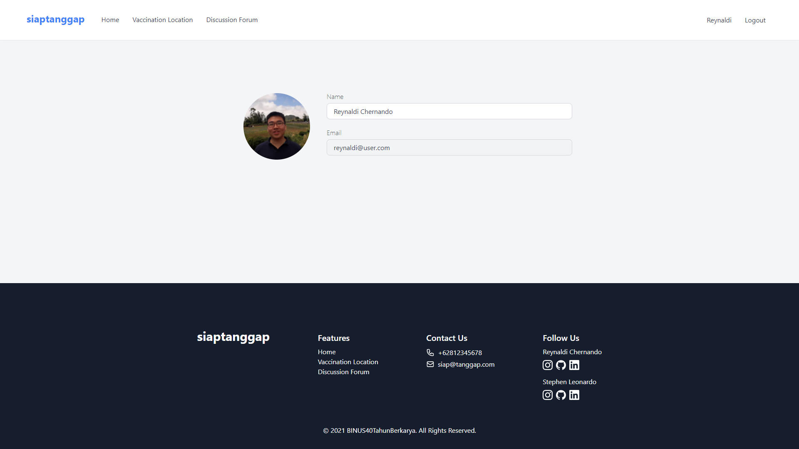
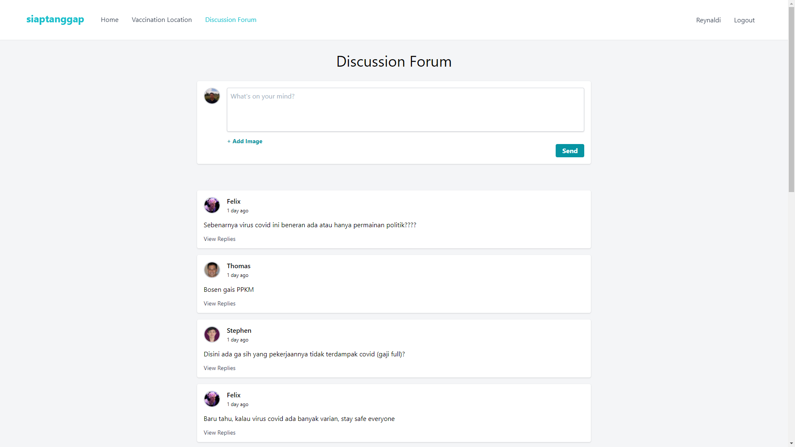

# siaptanggap

Information Center for Covid-19 in Indonesia. Get latest news related to Covid-19 and vaccinations in Indonesia.

## Technology
- Laravel 8
- TailwindCSS
- MySQL
- PHP

## Usage
Installation
1. Unzip the project folder and run the XAMPP program.
2. Create database in phpmyadmin with the name "siap-tanggap" (without quotes)
3. Import database from siap-tanggal.sql file
4. Insert siap-tanggap folder into XAMPP htdocs directory, as shown in the picture

5. Open browser with the URL http://localhost/siap-tanggap/, as shown in the picture

User credentials for login:
- reynaldi@user.com
- stephen@user.com
- naomi@user.com
- thomas@user.com
- felix@user.com

with the password 12345678

## Screenshots

## Team BINUS40TahunBerkarya
- Reynaldi Chernando
- Stephen Leonardo
